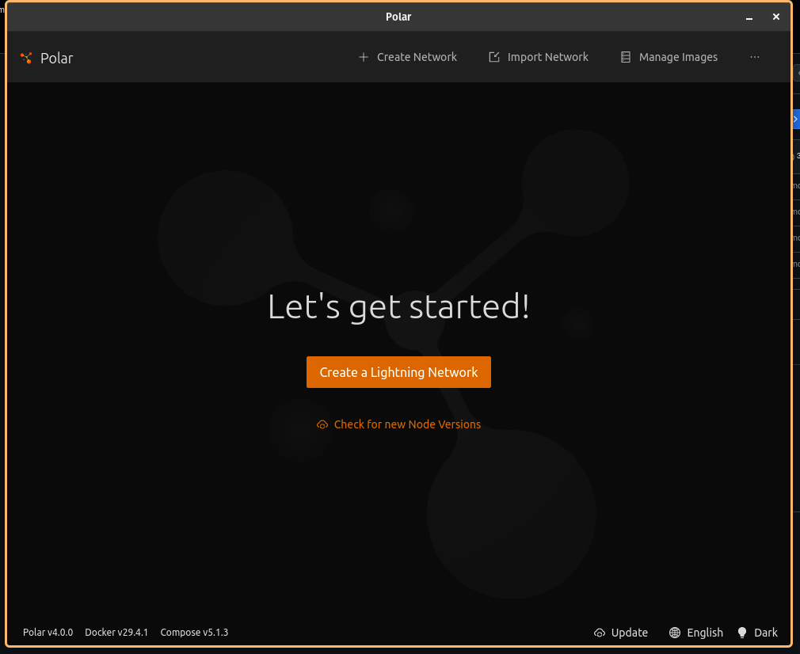

# rust-for-bitcoin

A command-line tool for interacting with a Bitcoin Core node over JSON-RPC, built for the Rust for Bitcoin Program 2.0 technical assessment. It provides a handful of fixed commands for common node/wallet queries, plus a generic `rpc` passthrough for calling any Bitcoin Core RPC method directly.

## Project Overview

The CLI is organized around three pieces:

- **`config`** — resolves RPC connection settings from `CLI` flags, environment variables, or an optional JSON config file (in that order of precedence). No credentials are ever hard-coded.
- **`rpc`** — a small reusable JSON-RPC client that handles authentication, request/response encoding.
- **`commands`** — one module per subcommand, each responsible for calling the right RPC method(s) and formatting the result. Fixed-command responses are deserialized into typed structs rather than handled as raw JSON.

```
src/
├── main.rs          # entry point, dispatches to commands, maps errors to exit codes
├── cli.rs            # clap argument/subcommand definitions
├── config.rs          # config resolution (flags > env > file)
├── error.rs           # error types for documented failure modes
├── rpc.rs            # JSON-RPC client
└── commands/
    ├── blockchain.rs  # blockchain-info
    ├── wallet.rs       # wallet-info, balance
    └── address.rs      # new-address
```

## Installation

Requires a recent Rust toolchain (edition 2024, stable channel).

```bash
git clone <this-repo-url>
cd rust-for-bitcoin
cargo build --release
```

The compiled binary will be at `target/release/rust-for-bitcoin`. You can also run it directly during development with `cargo run -- <args>`.

## Setting Up Polar

Polar is a one-click Bitcoin Lightning networks for local app development & testing. This project was developed and tested against a [Polar](https://lightningpolar.com/) regtest network. Note that, these install instructions are for linux POP-OS . Please check the Issues section for common blockers when setting up Polars & Docker.

1. Download  [Polar](https://lightningpolar.com/) test environment. For Linux, you'd receive `polar-linux-x86_64-v4.0.0.AppImage` which is an `AppImage application bundle (application/vnd.appimage)`. Open the folder in your terminal (`Downloads` in this case) and make it executable with
   `test@pop-os:~/Desktop/RustRover-2024.3.6$ chmod +x polar-linux-x86_64-v4.0.0.AppImage.
2.  Make sure `Docker/Docker Desktop` is installed and running.
3.  If successful with the previous steps, you'd see a welcome page.
   
4. Enter the name of the network and click **Start**.  First start will take longer since it pulls the `polarlightning/bitcoind` Docker image.
5. Once the node's status shows **Started**, open its **Connect** tab to get the RPC host, port, username, and password.
   

## Running the Bitcoin Core Node

With the Polar node running, create and fund a wallet so commands have real data to work with. Open a terminal on the node (via Polar's "Actions" tab, or right-click the node). the bitcoin-cli regtest network is aliased.  You'd see something similar like below:

```bash
Updating bitcoin-cli to always use the regtest network
alias bitcoin-cli="bitcoin-cli -regtest"

bitcoin@backend1:/$ alias bitcoin-cli="bitcoin-cli -regtest"
bitcoin@backend1:/$ 
```

Create a bitcoin wallet
```bash
bitcoin-cli createwallet "testwallet" 
```

Mine 101 blocks by clicking on the `Quick Mine` button in the UI(next to `height: 1` ). This mines 101 blocks to a fresh address in testwallet. or run the below in the terminal

```bash
bitcoin-cli -rpcwallet=testwallet generatetoaddress 101 $(bitcoin-cli -rpcwallet=testwallet getnewaddress)
```

## Configuring the Application

First and Foremost, run `cargo build --release` to get the binary in the `./target/debug/` folder . Then run the help command ```

```bash

test@pop-os:~/Desktop/rust/rust-for-bitcoin$ ./target/debug/rust-for-bitcoin --help
A CLI program for talking to a Bitcoin Core node over JSON-RPC.

Connection settings can be provided via flags, environment variables (RFB_RPC_URL / RFB_RPC_USER / RFB_RPC_PASS / RFB_WALLET), or a JSON config file passed with --config. Flags win over env vars, which win over the config file.

Usage: rust-for-bitcoin [OPTIONS] <COMMAND>

Commands:
  blockchain-info  Show chain, block/header counts, difficulty and sync progress
  wallet-info      Show wallet name, balance, unconfirmed balance and tx count
  balance          Print Wallet Balance
  new-address      Generate and print new receiving address
  rpc              Call an arbitrary Bitcoin Core RPC method
  help             Print this message or the help of the given subcommand(s)

Options:
      --rpc-url <RPC_URL> 
	      Bitcoin Core RPC URL, e.g. http://127.0.0.1:18443
	      [env: RFB_RPC_URL=]

      --rpc-user <RPC_USER>
          RPC username
          [env: RFB_RPC_USER=]

      --rpc-password <RPC_PASSWORD>
          RPC password
          [env: RFB_RPC_PASSWORD=]

      --wallet <WALLET>
          Wallet name to operate on (required for wallet scoped commands)
          [env: RFB_WALLET=]

      --config <CONFIG>
          Optional path to a JSON config file which contain rpc_url/rpc_password/wallet

  -h, --help
          Print help (see a summary with '-h')

  -V, --version
          Print version
```

Connection settings can be supplied three ways, in order of precedence (highest wins):

1. **CLI flags**
2. **Environment variables**
3. **JSON config file**

If none of the three supply a required value, the program exits with a clear error rather than falling back to a hardcoded default.

| Setting      | Flag             | Env var        | Config file key |
| ------------ | ---------------- | -------------- | --------------- |
| RPC URL      | `--rpc-url`      | `RPC_URL`      | `rpc_url`       |
| RPC user     | `--rpc-user`     | `RPC_USER`     | `rpc_user`      |
| RPC password | `--rpc-password` | `RPC_PASSWORD` | `rpc_password`  |
| Wallet name  | `--wallet`       | `WALLET`       | `wallet`        |

**Example: environment variables**

```bash
export RPC_URL="http://127.0.0.1:18443"
export RPC_USER="polaruser"
export RPC_PASS="polarpass"
export WALLET="testwallet"

test@pop-os:~/Desktop/rust/rust-for-bitcoin$ ./target/debug/rust-for-bitcoin blockchain-info
```

**Example: file : config.json**

```json

{
  "rpc_url": "http://127.0.0.1:18443",
  "rpc_user": "polaruser",
  "rpc_pass": "polarpass",
  "wallet": "testwallet"
}
```

```bash
test@pop-os:~/Desktop/rust/rust-for-bitcoin$ ./target/debug/rust-for-bitcoin --config config.json blockchain-info
```

**Example: flags** (overrides both of the above)

```bash
./target/debug/rust-for-bitcoin --rpc-url http://127.0.0.1:18443 --rpc-user polaruser --rpc-password polarpass blockchain-info
```

## Example Commands

```bash

test@pop-os:~/Desktop/rust/rust-for-bitcoin$ ./target/debug/rust-for-bitcoin --config config.json blockchain-info
chain: regtest
Number of blocks: 105
Number of headers: 105
difficulty: 0.00000000046565423739069247
Verification Progress: 0.9198913486822125

test@pop-os:~/Desktop/rust/rust-for-bitcoin$ ./target/debug/rust-for-bitcoin --config config.json wallet-info
Wallet name:        testwallet
Number of Transactions: 104

# for the DEPRECATED fields in wallet-info 
test@pop-os:~/Desktop/rust/rust-for-bitcoin$ ./target/debug/rust-for-bitcoin --config config.json balance
balance: 169.9999436 BTC
unconfirmed balance: 0.0 BTC

test@pop-os:~/Desktop/rust/rust-for-bitcoin$ ./target/debug/rust-for-bitcoin --config config.json rpc getbalance
169.9999436

# note that this an RPC call
test@pop-os:~/Desktop/rust/rust-for-bitcoin$ ./target/debug/rust-for-bitcoin --config config.json rpc getblockchaininfo
{
  "bestblockhash": "68262e6094024ad5e6b022590c9a92745782bcdd8140d590640a57ce086e6aee",
  "bits": "207fffff",
  "blocks": 105,
  "chain": "regtest",
  "chainwork": "00000000000000000000000000000000000000000000000000000000000000d4",
  "difficulty": 4.6565423739069247e-10,
  "headers": 105,
  "initialblockdownload": false,
  "mediantime": 1784207644,
  "pruned": false,
  "size_on_disk": 31567,
  "target": "7fffff0000000000000000000000000000000000000000000000000000000000",
  "time": 1784233728,
  "verificationprogress": 0.9192132921710776,
  "warnings": []
}
```

## Assumptions and Design Decisions

- I assumed the **Installation** section required in the [Documentation](https://github.com/thebuidl-grid/rfb-assessment#documentation) section means cloning   and running the repository since it's a bit unclear what installation means.
- In the [Bitcoin Developer Docs](https://developer.bitcoin.org/reference/rpc/getwalletinfo.html) . The rpc command `walletinfo`  fields `balance` and `unconfirmed_balance` is deprecated and moved to the rpc call `getbalances`
  ```
    "balance": n, (numeric) DEPRECATED. Identical to getbalances().mine.trusted
    "unconfirmed_balance": n, (numeric) DEPRECATED. Identical to getbalances().mine.untrusted_pending
  ```
  The `balance` command is used to get this information.
- **No hardcoded credentials.** Connection details always come from flags, env vars, or an explicit config file — never baked into source.
- **Fixed commands use typed responses.** `blockchain-info`, `wallet-info`, and `balance` deserialize Core's JSON into structs rather than pulling fields out of a generic `serde_json::Value`, so a response-shape mismatch fails loudly at parse time instead of silently producing wrong output.
- **The generic `rpc` command is a thin passthrough.** It does not attempt to type-check or validate parameters against Core's method signatures; it forwards them as given and prints the raw JSON result. Parameters are parsed as JSON where possible.
- **No panics on failure paths.** Connection failures, authentication failures, invalid parameters, and unknown methods are all mapped to distinct error variants (`src/error.rs`) with a single-line, human-readable message and a non-zero exit code.
- **Lightning nodes were intentionally excluded** from the Polar network used for development, since this project only exercises Bitcoin Core's RPC surface.

## Issues
1. Docker Socket not found. If this error is encountered, but you have the Docker/Docker Desktop running, create a symlink by:
 ```bash sudo ln -s /home/test/.docker/desktop/docker.sock /var/run/docker.sock```


2. No Wallet is loaded. If this error is encountered, but you have created the wallet 


 - Run bitcoin-cli listwallets from the node terminal to see what's actually loaded. the default wallet is an empty string "" which is first loaded and cause the above issue

   ```bash
   bitcoin@backend1:/$ bitcoin-cli listwallets                         
    [
    "",
    "testwallet"
    ]
   ```
 - Unload the wallet and run the `listwallets` command again see if the empty string is unloaded
   ```bash 
    bitcoin-cli unloadwallet
   
    bitcoin-cli listwallets
   ["testwallets"]
```
